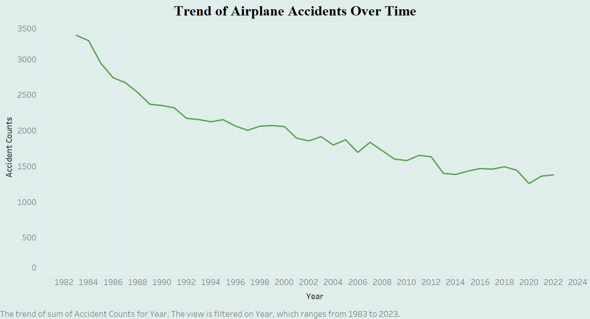
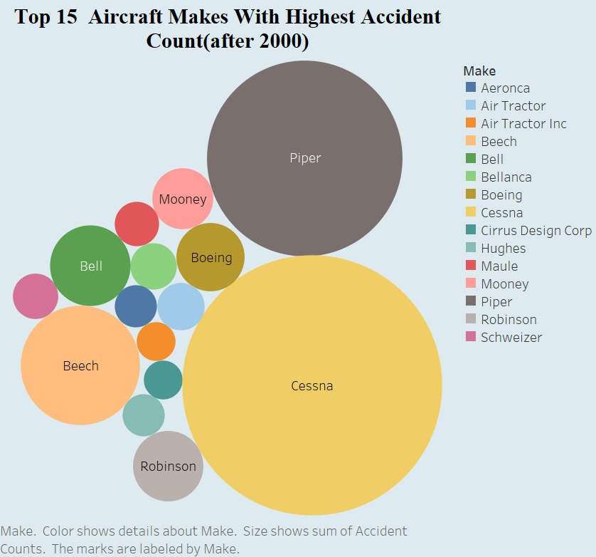
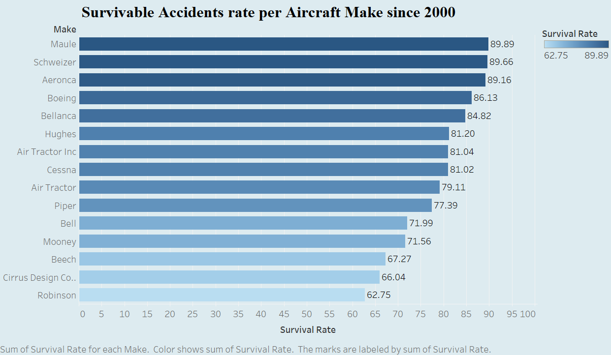

# Aircraft Safety Analysis Project

## 1. Overview

The aviation industry is committed to enhancing safety measures and reducing accident rates. This project analyzes historical aircraft accident data to identify trends, assess safety risks, and provide insights for stakeholders in the aviation sector.

## 2. Business Understanding

The primary stakeholders for this analysis are . The key business questions addressed in this project are:

- **What are the trends in aviation accidents over the years?**
  - Understanding whether aviation safety has improved or declined over time.

- **Which aircraft manufacturers have the highest number of accidents?**
  - Identifying manufacturers associated with higher accident counts to assess potential safety concerns.

- **What are the survival rates across different aircraft makes?**
  - Evaluating passenger survival rates to determine which aircraft models offer better safety outcomes.

Addressing these questions will provide actionable insights to enhance safety protocols, inform aircraft purchasing decisions, and improve overall passenger safety.

## 3. Data Understanding and Analysis

This project utilizes data from reputable aviation safety databases, including information on aircraft accidents such as date, location, aircraft type, manufacturer, number of fatalities, and survival rates.

**Data Processing Steps:**

- **Data Collection:** Gathered aviation data from kaggle.
- **Data Cleaning:** Handled missing values, standardized manufacturer names, and corrected inconsistencies.
- **Data Analysis:** Performed exploratory data analysis to identify trends and patterns.
- **Visualization:** Created graphs to depict accident trends, manufacturer accident counts, and survival rates.

**Key Visualizations:**

- **Trends in Aviation Accidents Over the Years:**
  

- **Accident Counts by Aircraft Manufacturer(Top 15):**
  

- **Survival Rates by Aircraft Model(Top 15):**
  

## 4. Conclusion

Based on the analysis, the following recommendations are proposed:

1. Prioritize Aircraft with a Survival Rate Above 80% – Models that exceed this threshold demonstrate better crash survivability and passenger safety.

2. Invest in Newer Aircraft Models – The decreasing trend in accidents over time suggests that modern planes are safer and acquiring them will reduce the likelihood of accidents and enhance overall safety.

3. Conduct Further Safety Evaluations Before Purchase – Beyond historical data, factors such as maintenance records, technological advancements, and compliance with modern aviation safety standards should be assessed to ensure long-term operational safety and reliability.

By focusing on these areas, stakeholders can make informed decisions to improve aviation safety and reduce accident rates.
